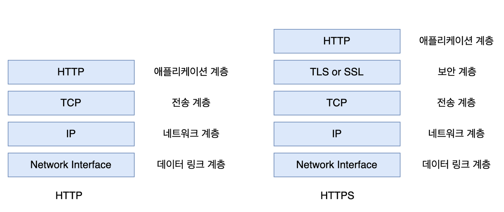
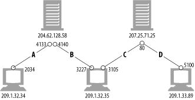
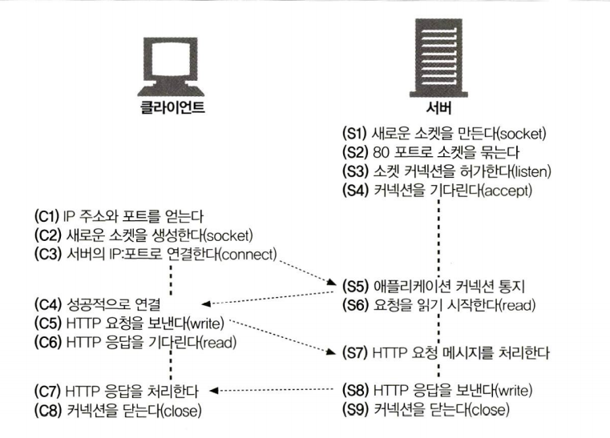
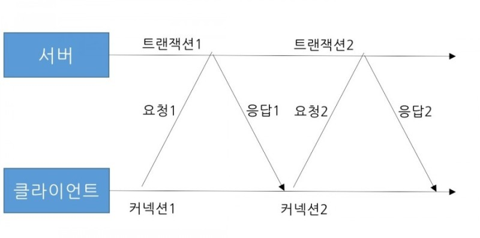

# 4장 커넥션 관리

### Goal

- HTTP는 어떻게 TCP 커넥션을 사용하는가
- TCP 커넥션의 지연, 병목, 막힘
- 병렬 커넥션, keep-alive 커넥션, 커넥션 파이프라인을 활용한 HTTP의 최적화
- 커넥션 관리를 위해 따라야 할 규칙들

<br>

## 4.1 TCP 커넥션

- TCP/IP는 패킷 교환 네트워크 프로토콜들의 계층화된 집합이다.
- 모든 HTTP 통신은 TCP/IP를 통해 이루어진다.
- TCP/IP 커넥션이 맺어지면 클라이언트와 서버간 메시지들은 안전하게 전달된다.
- 브라우저가 호스트에 대한 IP 주소를 찾고 포트번호를 얻으면 IP와 포트번호로 TCP 커넥션을 생성한다.

### 4.1.1 신뢰할 수 있는 데이터 전송 통로인 TCP

```
클라이언트(get/index.html) ->   ...lmth.xedni/teg   -> 서버
```

- TCP 커넥션의 바이트들은 반대쪽 순서에 맞게 정확히 전달된다.

### 4.1.2 TCP 스트림은 세그먼트로 나뉘어 IP 패킷을 통해 전송된다.



- TCP는 작은 조각인 IP 패킷을 통해 데이터를 전송한다.
- 세그먼트 단위로 데이터 스트림을 나누고 세그먼트를 IP 패킷이라는 봉투로 담아서 인터넷읗 통해 데이터를 전달한다.
- 이 과정은 TCP/IP 소프트웨어에 의해 처리되며 개발자에게 보이지않고 숨겨진다.
- IP 패킷은 다음과 같이 구성된다
  - IP 패킷 헤더(20바이트): 발신지, 목저기, IP 주소, 크기 등
  - TCP 세그먼트 헤더(20바이트): TCP 포트 번호, 순서 보장과 무결성 검사를 위한 숫자 값
  - TCP 데이터 조각({0,})

### 4.1.3 TCP 커넥션 유지하기

TCP 커넥션은 네 가지 값으로 식별한다.

```
<발신지 IP 주소, 발신지 포트, 수신지 IP 주소, 수신지 포트>
```

- 컴퓨터는 포트번호를 통해 여러개의 TCP 커넥션을 유지한다.
- IP 주소는 해당 컴퓨터에 연결되고 포트 번호는 해당 어플리케이션으로 연결된다.



### 4.1.4 TCP 소켓 프로그래밍

- 운영체제는 TCP 커넥션 생성과 관련된 여러 API를 제공한다.
- 소켓 API는 TCP 종단 데이터 구조 생성하고 연결해 데이터를 읽고 쓸 수 있는 인터페이스를 제공한다.

TCP 커넥션을 사용해 상호작용하는 과정은 다음과 같다.



<br>

## 4.2 TCP 성능에 대한 고려

- HTTP는 어플리케이션 계층으로 TCP가 속한 전송 계층 바로 위 계층이다.
- 따라서 HTTP 트랜잭션의 성능은 TCP 성능에 영향을 받는다.

### 4.2.1 HTTP 트랜잭션 지연

HTTP 트랜잭션은 다음과 같은 과정으로 처리된다.


1. URI에서 IP 주소와 포트번호를 DNS를 통해 알아낸다.
2. TCP 커넥션 요청을 서버로 보내고 응답을 기다린다.
3. 커넥션이 맺어지면 HTTP 요청을 새로 생성된 TCP 파이프를 통해 전송한다.
4. 서버는 데이터가 도착하는데로 요청 메시지를 읽고 처리한다.
5. 클라이언트로 HTTP 응답을 보낸다.

### 4.2.2 성능 관련 중요 요소

다음은 고성능 HTTP 소프트웨어의 성능 최적화시 고려해야 하는 TCP 관련 지연에 대한 내용이다.(참고)

- TCP 커넥션 핸드셰이크 지연: 크기가 작은 HTTP 트랜잭션은 50% 이상의 시간을 TCP를 구성하는데 쓴다.
- 확인응답 지연: TCP 세그먼트는 순서와 무결성 보장을 위한 체크섬을 가지며 수신자는 확인응답 패킷을 송신자에게 반환한다.
- TCP 느린 시작: TCP 전송 속도는 커넥션이 만들어진지 얼마나 되었는가에 따라 달라질 수 있다. 이를 통해 부하와 혼잡을 방지한다.
- 네이글 알고리즘과 TCP_NODELAY: HTTP 어플리케이션은 성능 향상을 위해 HTTP 스택에 TCP_NODELAY 파라미터 값을 설정해 네이글 알고리즘(네트워크 효율을 위해 많은 양의 TCP 데이터를 하나의 덩어리로 합침)을 비활성화 하기도 한다.
- TIME_WAIT의 누적과 포트 고갈:

<br>

## 4.3 HTTP 커넥션 관리

다음은 HTTP 커넥션 최적화에 대한 내용이다.

### 4.3.1 흔히 잘못 이해하는 Connection 헤더

- Connection 헤더는 현재의 커넥션이 완료된 후 네트워크 접속을 유지할지 말지를 제어한다.
- 커넥션 토큰이 HTTP 헤더 필드 명을 가지고 있으면 해당 필드들은 현재 커넥션만을 위한 정보이므로 다음 커넥션이 전달하면 안된다.
- Connection 헤더에 있는 모든 헤더 필드는 메시지를 다른 곳으로 전달하는 시점에 삭제되어야 한다.

### 4.3.2 순차적인 트랜잭션 처리에 의한 지연



- 브라우저가 페이지를 보여주기 위해 다수의 트랜잭션을 만들어야하고 각 트랙잭션이 새로운 커넥션을 필요로 한다면 지연이 발생한다.
- 이러한 순차적 처리로 인한 지연은 로드전까지 텅빈 화면을 보여주기 때문에 좋지 않은 UX를 제공한다.
- 이어지는 4.4 ~ 4.7은 HTTP 커넥션의 성능을 향상시킬 수 있는 기술들이다.

<br>

## 4.4 병렬 커넥션


HTTP는 클라이언트가 여러 개의 커넥션을 맺음으로써 여러 개의 HTTP 트랜잭션을 병렬로 처리할 수 있다.

### 4.4.1 병렬 커넥션은 페이지를 더 빠르게 내려 받는다.

- 각 커넥션의 지연을 겹치게하면 총 지연 시간을 줄일 수 있다.
- 클라이언트의 인터넷 대역폭을 한 개의 커넥션이 다 쓰는게 아니므로 나머지 객체를 내려받는데 남은 대역폭을 사용한다.

### 4.4.2 병렬 커넥션이 항상 더 빠르지는 않다.

- 클라이언트의 네트워크 대역폭이 좁을 때는 병렬 커넥션의 장점이 거의 없어진다.
- 브라우저는 실제 병렬 커넥션을 사용하긴 하지만 적은 수의 병렬 커넥션만 사용한다.

### 4.4.3 병렬 커넥션은 더 빠르게 느껴질 수 있다.

- 병렬 커넥션이 항상 빠르게 로드하는 것은 아니지만 동시에 로드되므로 더 빠르게 보이는 효과가 있다.

<br>

## 4.5 지속 커넥션

HTTP 1.1을 지원하는 기기는 처리가 완료된 후에도 TCP 커넥션을 유지해 이어지는 HTTP 요청에 재사용할 수 있다.

### 4.5.1 지속 vs 병렬 커넥션

- 병렬 커넥션은 다음과 같은 단점이 있다.
  - 트랜젝션마다 커넥션을 맺고 끊는 시간과 대역폭이 소요된다.
  - TCP 느린 시작과 커넥션 수의 제한으로 성능이 떨어질 수 있다.
- 지속 커넥션은 이러한 병렬 커넥션의 단점을 극복할 수 있다.
  - 커넥션 사전 작업과 지연을 줄여준다.
  - 커넥션의 수를 줄여준다.
- 지속 커넥션은 HTTP/1.0의 `keep-alive`와 1.1의 `지속` 커넥션이 있다.
- 지속 커넥션은 병렬 커넥션과 함께 사용될 때 가장 효과적이다.

### 4.5.2~ 4.5.7 keep-alive 커넥션

- keep-alive는 HTTP/1.0에서 추가되었고 1.1 명세에서 빠졌지만 아직도 브라우저와 서버간 keep-alive 핸드셰이크가 널리 사용된다.
- HTTP/1.0 keep-alive 커넥션을 구현한 클라이언트는 커넥션 유지를 위해 `Connection: Keep-alive`헤더를 포함시킨다.
- keep alive 요청 후 `Connection: Keep-Alive` 응답 헤더가 없으면 연결을 끊는다는 의미다.
- `Keep-Alive: ... ` 응답 헤더에 max, timeout 파라미터를 통해 지속 커넥션에 대한 세부 내용을 포함할 수 있다.
- Keep-Alive는 멍청한 프락시에서 사용하면 문제가 된다. ([멍청한 프락시란?](https://m.blog.naver.com/dlaxodud2388/222042540929))

### 4.5.8 HTTP/1.1의 지속 커넥션

- 지속 커넥션은 기본으로 활성화되어 있다.
- 커넥션을 끊으려면 `Connection:close` 헤더를 명시해야 한다.

<br>

## 4.6 파이프라인 커넥션


- HTTP/1.1은 지속 커넥션을 통해 요청을 파이프 라이닝할 수 있다.
- 여러개의 요청이 응답이 도착하기전 큐에 쌓인다.

<br>

## 4.7 커넥션 끊기에 대한 미스터리

커넥션을 언제 끊을까에 대한 명확한 기준은 없다.

### 4.7.1 '마음대로' 커넥션 끊기

- HTTP 클라이언트, 서버, 혹은 프락시는 언제든지 TCP 전송 커넥션을 끊을 수 있다.
- 그러나 끊는 시점에 데이터를 전송하지 않을 것이라고 확신하지 못하기 때문에 문제가 생길 수 있다.

### 4.7.2 Content-Length와 Truncation

- HTTP 응답은 본문의 정확한 크기 값을 가지는 Content-Length 헤더를 가지고 있어야 한다.
- 클라이언트나 프락시가 커넥션이 끊어졌다는 HTTP 응답을 받은 후, 이에 대한 값이 일치하지 않거나 존재하지 않으면 수신자는 정확한 길이를 서버에 요청해야 한다.

### 4.7.3 커넥션 끊기의 허용, 재시도, 멱등성

- 커넥션은 에러가 없더라도 언제든 끊을 수 있다.
- 비멱등 메서드들은 파이프라인을 통해 요청해선 안된다.

### 4.7.4 우아한 커넥션 끊기

- TCP 커넥션은 양방향이다.
- 우아한 커넥션 끊기란 자신의 출력 채널을 먼저 끊고 다른쪽 채널이 끊길 때 까지 기다리는 것이다.
