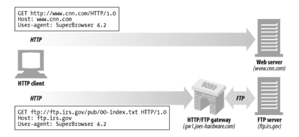
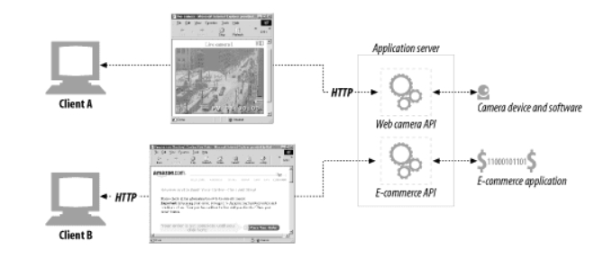
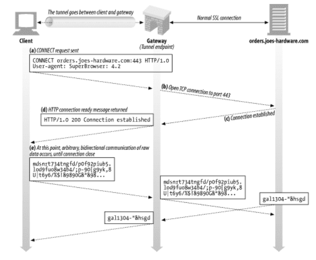

# 8장 통합점: 게이트웨이, 터널, 릴레이

HTTP 어플리케이션은 인터넷 상의 콘텐츠에 접근하는 통일된 방법을 제공한다.

8장에서는 다음과 같은 내용을 다룬다.

- 여러 종류의 리소스에 접근하는데 HTTP가 어떻게 쓰이는지
- 다른 프로토콜이나 어플리케이션 간 통신에 HTTP를 어떻게 사용하는지

## 8.1 게이트웨이

- 서로 다른 프로토콜과 애플리케이션 간의 HTTP 인터페이스다.
- 요청을 받고 응답을 보내는 포털 같이 동작하는데, 동적인 콘텐츠를 생성하거나 데이터베이스에 질의를 보낼 수 있다.
- HTTP 트래픽을 다른 프로토콜로 자동으로 변환하여, HTTP 클라이언트가 다른 프로토콜을 알 필요 없이 서버에 접속할 수 있게 하기도 한다.

### 8.1.1 클라이언트 측 게이트웨이와 서버 측 게이트웨이

```
<클라이언트 프로토콜>/<서버 프로토콜>
```

- 웹 게이트웨이는 한쪽에서는 HTTP로 통신하고 다른 한쪽에서는 다른 프로토콜로 통신한다.
- 게이트웨이는 클라이언트 프로토콜과 서버 프로토콜을 `/` 으로 구분해 기술한다.
- 서버 측 게이트웨이는 클라이언트와 HTTP로, 클라이언트 측 게이트웨이는 서버와 HTTP로 통신한다.

<br>

## 8.2 프로토콜 게이트웨이



- 프락시에 트래픽을 바로 보내는 것처럼 게이트웨이에도 HTTP 트래픽을 바로 보낼 수 있다.
- 브라우저에 명시하거나, 게이트웨이를 대리 서버(리버스 프락시)로 설정해 트래픽을 보낼 수 있다.
- 일반 HTTP 트래픽은 원 서버로, 다른 프로토콜을 포함한 요청은 게이트웨이로 HTTP 요청을 보낸다.

### 8.2.1 HTTP/`*`: 서버 측 웹 게이트웨이

- 서버 측 웹 게이트웨이는 클라이언트로부터 HTTP 요청이 원 서버 영역으로 들어오는 시점에 클라이언트 측의 HTTP 요청을 외래 프로토콜로 전환한다.
- HTTP/FTP 게이트웨이는 다음과 같이 동작한다.
  - USER 와 PASS 명령을 보내서 서버에 로그인한다.
  - 서버에서 적절한 디렉터리로 변경하기 위해 CWD 명령을 내린다.
  - 다운로드 형식을 ASCII로 설정한다.
  - MDTM 으로 문서의 최근 수정 시간을 가져온다.
  - PASV로 서버에게 수동형 데이터 검색을 하겠다고 말한다.
  - RETR로 객체를 검색한다.
  - 제어 채널에서 반환된 포트로 FTP 서버에 데이터 커넥션을 맺는다.
  - 객체를 받는대로 HTTP 응답에 실어서 클라이언트에 전송한다.

### 8.2.2 HTTP/HTTPS: 서버 측 보안 게이트웨이

- 기업 내부의 웹 요청을 암호화함으로써 개인 정보 보호와 보안을 제공하는데 게이트웨이를 사용할 수 있다.
  - 클라이언트는 HTTP를 사용하여 웹을 탐색 할 수 있다.
  - 게이트웨이는 자동으로 사용자의 모든 세션을 HTTPS를 사용해 암호화한다.

### 8.2.3 HTTPS/HTTP: 클라이언트 측 보안 가속 게이트웨이

- HTTPS/HTTP 게이트웨이는 웹 서버의 앞단에 위치하고, 보이지 않는 인터셉트 게이트웨이나 리버스 프락시 역할을 한다.
- 게이트웨이는 보안 HTTPS 트래픽을 받아서 복호화하고, 웹 서버로 보낼 일반 HTTP 요청을 만든다.
  - 보안 트래픽을 복호화하는 암호화 하드웨어를 내장해 원 서버의 부하를 줄여준다.
  - 게이트웨이와 원 서버 간의 암호화하지 않은 트래픽을 전송하기 때문에 게이트웨이와 원 서버 간에 있는 네트워크가 안전한지 확인을 하고 사용해야한다.

<br>

## 8.3 리소스 게이트웨이



- 게이트웨이의 가장 일반적인 형태는 애플리케이션 서버는 목적지 서버와 게이트웨이를 한 개의 서버로 결합한 형태다.
- 하나의 애플리케이션 서버를 통해 다수의 클라이언트가 백엔드와 통신할 수 있다.
- 애플리케이션 서버는 HTTP를 통해서 클라이언트와 통신하고 서버 측에 있는 애플리케이션 프로그램에 연결하는 서버 측 게이트웨이다.

### 8.3.1 공용 게이트웨이 인터페이스

- 공용 게이트웨이 인터페이스(CGI)는 최초의 서버 확장이자 지금까지도 가장 널리 쓰이는 서버 확장이다.
- 웹에서 동적인 HTML, 신용카드, 데이터베이스 질의 등을 제공하는데 쓰인다.
- CGI 내부에서 어떤 처리를 하는지 사용자에게 보이지 않으며 일반적인 요청을 만드는 것처럼 보인다.
- CGI는 모든 요청마다 새로운 프로세스를 만드는데 따르는 부하가 꽤 크다.
- 사용하는 서버의 성능을 제한하며 서버 장비에 부담을 준다.
- 이런 문제를 해결하기 위해 새로운 CGI 형식인 Fast CGI가 개발되었다.

### 8.3.2 서버 확장 API

- 서버 자체의 동작을 바꾸고 싶거나 서버의 처리능력을 최고치로 끌어 올리고자 할 때 사용된다.
- 웹 개발자가 자신의 모듈을 HTTP와 직접 연결할 수 있는 강력한 인터페이스다.
- 확장 API 는 프로그래머가 자신의 코드를 서버에 연결하거나 서버의 컴포넌트를 자신이 만든 것으로 교체해버릴 수 있게 하였다.

<br>

## 8.4 애플리케이션 인터페이스와 웹 서비스

- 데이터를 교환하려는 두 애플리케이션 사이에서 프로토콜 인터페이스를 맞추는 것은 까다로운 이슈다.
- 웹 서비스는 SOAP을 통해 XML을 사용해 정보를 교환한다.
  - XML은 데이터 객체를 담는 데이터를 생성하고 해석하는 방식을 제공한다.
  - SOAP는 HTTP 메시지에 XML 데이터를 담는 방식에 관한 표준이다.

<br>

## 8.5 터널

- 터널링이란 데이터 스트림을 인터넷 상에서 가상의 파이프를 통해 전달시키는 기술로, 패킷 내에 터널링할 대상을 캡슐화시켜 목적지까지 전송하는 것을 의미한다.
- HTTP 커넥션을 통해서 HTTP가 아닌 트래픽을 전송할 수 있다.
- 웹 터널은 HTTP 프로토콜을 지원하지 않는 애플리케이션에 HTTP 애플리케이션을 사용해 접근하는 방법을 제공한다.
- 다른 프로토콜을 HTTP 위에 올릴 수 있다.

### 8.5.1 CONNECT로 HTTP 터널 커넥션 맺기

- 웹 터널은 HTTP 의 CONNECT 메서드를 사용하여 커넥션을 맺는다.
- CONNECT 메서드는 터널 게이트웨이가 임의의 목적 서버와 포트에 TCP 커넥션을 맺고 클라이언트와 서버 간에 오는 데이터를 무조건 전달하기를 요청한다.



#### CONNECT 요청

```
CONNECT xxxx:443 HTTP/1.0
User-agent: xxx
```

- 요청 URI는 호스트명이 대신하며 콜론에 이어 포트를 기술한다.

#### CONNECT 응답

```
HTTP/1.0 200 Connection Established
```

- 클라이언트는 요청을 전송한 다음, 게이트웨이의 응답을 기다린다. 일반 HTTP 메시지와 같이 200 응답 코드는 성공을 뜻한다.
- 일반적인 응답과 달리 Content-Type 헤더를 포함할 필요는 없다.

### 8.5.2 데이터 터널링, 시간, 커넥션 관리

- 터널을 통해 전달되는 데이터는 게이트웨이에서 볼 수 없어서 게이트웨이는 패킷의 순서나 흐름에 대해 어떤 가정도 할 수 없다.
- 클라이언트는 성능을 높이기 위해 CONNECT 요청을 보낸 다음, 응답을 받기전에 터널 데이터를 전송할 수 있다.
- 게이트웨이는 커넥션이 맺어지는 대로 헤더를 포함해서 읽어들인 모든 데이터를 서버에 전송해야한다.
- 요청 후에 터널을 통해 데이터를 전송한 클라이언트는 인증 요구나 200 외의 응답이 왔을 때 요청 데이터를 다시 보낼 준비가 되어 있어야한다.
- 커넥션이 끊긴 한쪽에 아직 전송하지 않은 데이터는 버려진다.

### 8.5.3 SSL 터널링

- 터널은 HTTP가 아닌 트래픽이 포트를 제한하는 방화벽을 통과하게 해준다.
- 웹 터널은 원래 방화벽을 통해서 암호화된 SSL 트래픽을 전달하려고 개발되었다.
- SSL 같이 암호화된 프로토콜은 정보가 암호화되어 있기 때문에 낡은 방식의 프락시에서는 처리되지 않는다.
- 터널을 사용하면 SSL 트래픽을 HTTP 커넥션으로 전송하여 80 포트의 HTTP 만을 허용하는 방화벽을 통과시킬 수 있다.
- 악의적인 트래픽이 사내로 유입되는 경로가 될 수도 있다.

### 8.5.4 SSL 터널링 vs HTTP/HTTPS 게이트웨이

- HTTPS 프로토콜은 다른 프로토콜과 같은 방식으로 게이트웨이를 통과할 수 있다.
  - 원격 HTTPS 서버와 SSL 세션을 시작하는 게이트웨이를 두고 클라이언트 측의 HTTPS 트랜잭션을 수행하는 방식으로 가능하다.
- 응답은 프락시가 받아서 복호화하고 난 후에 보안이 좋지 않은 HTTP를 통해 클라이언트로 전송한다.
- 위 방식은 다음과 같은 단점이 있다.
  - 클라이언트-게이트웨이 사이에는 보안이 적용되지 않은 일반 HTTP 커넥션이 맺어져있다.
  - 프락시가 인증을 담당하고 있기 때문에, 클라이언트는 원격 서버에 SSL 클라이언트 인증을 할 수 없다.
  - 게이트웨이는 SSL을 완벽히 지원해야한다.
- SSL 터널링을 사용하면 위와 같이 프락시에 SSL을 구현할 필요가 없다.
- 프락시 서버는 트랜잭션의 보안에는 관여하지 않고 암호화된 데이터를 그대로 터널링할 뿐이다.

### 8.5.5 터널 인증

- 게이트웨이는 터널 사용 허가를 내리기 전에 프락시 인증을 할 수 있다.
- 프락시 인증 기능은 클라이언트가 터널을 사용할 수 있는 권한을 검사하는 용도로 터널에서 사용할 수 있다.
-

### 8.5.6 터널 보안에 대한 고려사항들

- 터널 게이트웨이는 통신하고 있는 프로토콜이 터널을 올바른 용도로 사용하고 있는지 검증할 방법이 없다.
- 게이트웨이는 HTTPS 전용 포트인 443 같이 잘 알려진 특정 포트만을 터널링할 수 있게 허용해아한다.

<br>

## 8.6 릴레이

- HTTP 릴레이는 명세를 완전히 준수하지는 않는 간단한 HTTP 프락시다.
- 한 번에 한 개의 홉에 데이터를 전달하는데 사용한다.
- 커넥션을 맺기 위한 HTTP 통신을 한 다음, 바이트를 맹목적으로 전달한다.
- 이러한 맹목적 릴레이는 Connection 헤더를 제대로 처리하지 못해서 keep-alive 커넥션이 행(hang)에 걸리는 문제가 발생한다.
- 여러 문제를 예방하기 위해서 HTTP를 제대로 준수하는 프락시를 사용하는게 좋다.
