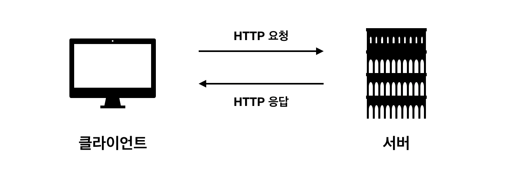

# HTTP 개관

## 1.1 HTTP란?
- HTTP는 Hypertext Transfer Protocol의 약자로, 전 세계의 웹브라우저, 서버, 웹 애플리케이션이 모두 사용하는 인터넷 공용어
- 신뢰성 있는 데이터 전송 프로토콜 사용
- 인터넷의 결함 및 약점에 대한 걱정 없이 기능 구현 가능

## 1.2 웹 클라이언트와 서버

- 웹 클라이언트와 웹 서버 통신
- 월드 와이드 웹(WWW)의 기본 요소
- 웹 클라이언트: 웹 서버에 HTTP 요청
- 웹 서버: 인터넷의 데이터 저장 및 HTTP 클라이언트가 요청한 데이터 제공

## 1.3 리소스
- 웹 서버가 관리하는 웹 콘텐츠의 원천
### 1.3.1 미디어 타입 - MIME
   - HTTP는 수천 개의 데이터 타입을 다루기 때문에 ‘MIME (Multipurpose Internet Mail Extensions, 다목적 인터넷 메일 확장)‘라는 데이터 포맷 라벨을 웹에서 전송되는 객체 각각에 붙임
   - 웹 콘텐츠가 어떤 데이터 타입인지 알려주는 라벨
   - 표현 형식: **‘주 타입/부 타입’**
     - HTML = ‘text/html’
     - JPEG = ‘image/jpeg’
     - GIF = ‘image/gif’
### 1.3.2 URI, URL, URN
   - URI: 통합 자원 식별자 (Uniform Resource Identifier)
     - 웹 서버 리소스의 이름
   - URL: 통합 자원 지시자 (Uniform Resource Locator)
     - 특정 서버의 한 리소스에 대한 구체적 위치 서술
     - 오늘날 대부분의 URI ≒ URL
     - 표현 형식: ‘스킴(HTTP 프로토콜) + 서버의 인터넷 주소 + 웹 서버의 리소스’ 
       - **https://google.com/main**
   - URN: 유니폼 리소스 이름 (Uniform Resource Name)
     - 리소스의 위치에 영향을 받지 않는 유일무이한 이름 역할

## 1.4 트랜잭션
- HTTP 트랜잭션은 클라이언트의 요청 명령과 서버의 응답 결과로 구성

- HTTP 메시지를 통해 이루어 짐
### 1.4.1 메서드
   - 서버에게 어떤 동작이 취해져야 하는지 알려주는 역할
   - 모든 HTTP 요청 메시지는 한 개의 메서드를 가짐
   - HTTP 메서드
     - GET: 서버에서 클라이언트로 지정한 리소스를 보내라
     - PUT: 클라이언트에서 서버로 보낸 데이터를 지정한 이름의 리소스로 저장하라
     - DELETE: 지정한 리소스를 서버에서 삭제하라
     - POST: 클라이언트 데이터를 서버 게이트웨이 애플리케이션으로 보내라
     - HEAD: 지정한 리소스에 대한 응답에서, HTTP 헤어 부분만 보내라 
### 1.4.2 상태 코드
   - 클라이언트의 요청의 성공 여부 등을 알려주는 세 자리 숫자
   - 모든 HTTP 응답 메시지는 상태 코드와 함께 반환
   - HTTP 상태 코드
      - 200: 문서가 바르게 반환되었다
      - 302: 다시 보내라. 다른 곳에 가서 리소스를 가져가라
      - 404: 리소스를 찾을 수 없다
### 1.4.3 웹페이지는 여러 객체로 이루어질 수 있다.
   - 보통 하나의 작업을 수행하기 위해 여러 HTTP 트랜잭션을 수행한다
   - index.html을 가져온 뒤 이미지, 그래픽, js, 등을 추가로 가져오기 위해 HTTP 트랜잭셔을 수행한다
   - 웹페이지는 보통 하나의 리소스가 아닌 리소스의 모음이다

## 1.5 메시지
- HTTP 메시지는 단순한 줄 단위의 문자열
- 종류
  - 요청 메시지: (클라이언트 → 서버)
  - 응답 메시지: (서버 → 클라이언트)
- 구성
   - 시작줄: 요청 및 응답에 대한 내용
   - 헤더
     - 0개 이상의 헤더 필드로 구성
     - 쌍점(:)으로 구분되어 있는 하나의 이름과 하나의 값으로 구성
     - 헤더는 빈 줄로 끝남
   - 본문
     - 어떤 종류의 데이터든 들어갈 수 있는 메시지 본문
     - 요청: 웹 서버로 데이터를 실어보냄
     - 응답: 클라이언트로 데이터 반환
     - 임의의 이진 데이터 포함 가능 (이미지, 비디오, 오디오, 텍스트 등)

     

## 1.6 TCP 커넥션
### 1.6.1 TCP/IP
   - TCP (Transmission Control Protocol, 전송 제어 프로토콜)
     - 오류 없는 데이터 전송
     - 순서에 맞는 전달 (언제나 보낸 순서대로 도착한다)
     - 조각나지 않는 데이터 스트림 (언제나 어떤 크기로든 전송 가능하다)
   - TCP/IP
      - TCP와 IP가 층을 이루는, 패킷 교환 네트워크 프로토콜의 집합
      - 각 네트워크와 하드웨어의 특성을 숨기고, 어떤 종류의 컴퓨터/네트워크든 서로 신뢰성 있는 의사소통을 가능하게 함
      - 일단 TCP 커넥션이 맺어지면, 클라이언트-서버 간의 HTTP 메시지가 없어지거나, 손상되거나, 순서가 바뀌어 수신되는 일은 결코 없다.
### 1.6.2 접속, IP 주소, 포트번호
   - HTTP 메시지를 전송하려면 IP (Internet Protocol, 인터넷 프로토콜) 주소와 포트번호를 사용해 클라이언트와 서버 사이에 TCP/IP 커넥션을 맺어야 함
   - 표현 형식: ‘IP 주소:포트번호’
     - http://207.200.83.29:80/index.html
     - http://www.netscape.com:80/index.html
     - http://www.netscape.com/index.html
   - IP 주소, 포트번호
     - 기본적으로 IP 주소는 숫자로 구성되어 있으나, IP 주소의 별명과도 같은 도메인 이름 혹은 호스트명으로 표현되어 있어도 도메인 이름 서비스(Domain Name Service, DNS)라 불리는 장치를 통해 쉽게 IP 주소로 다시 변환이 가능
     - 포트번호가 주소에 보이지 않는다면 기본 80
     - 클라이언트 - 서버 사이의 통신 순서
         1. 웹브라우저는 서버의 URL에서 호스트 명을 추출
         2. 서버의 호스트 명을 IP로 변환 및 포트번호 추출
         3. 웹 서버와 TCP 커넥션 맺음
         4. 서버에 HTTP 요청을 보냄
         5. 서버는 웹브라우저에 HTTP 응답을 돌려줌
         6. 커넥션이 닫히면 웹브라우저는 문서(응답)를 보여줌

## 1.7 프로토콜 버전
- HTTP/0.9: 심각한 디자인 결함이 다수 있는 표준 이전의 HTTP 버전
- HTTP/1.0: 처음으로 널리 쓰이기 시작한 HTTP 버전으로 헤더, 메서드, 멀티미디어 객체처리 추가
- HTTP/1.1: HTTP 설계의 구조적 결함 교정, 성능 최적화, 잘못된 기능 제거에 집중한 현재의 HTTP 버전
- HTTP/2.0: HTTP/1.1 성능 문제를 개선하기 위해 구글의 SPDY 프로토콜을 기반으로 설계 

## 1.8 웹의 구성요소
- 프락시: HTTP 중개자
- 캐시: 많이 찾는 웹페이지를 클라이언트 가까이에 보관하는 HTTP 창고
- 게이트웨이: 다른 애플리케이션과 연결된 특별한 웹 서버
- 터널: HTTP 통신을 전달하는 특별한 프락시
- 에이전트: 자동화된 HTTP 요청을 만드는 준지능적 웹클라이언트
