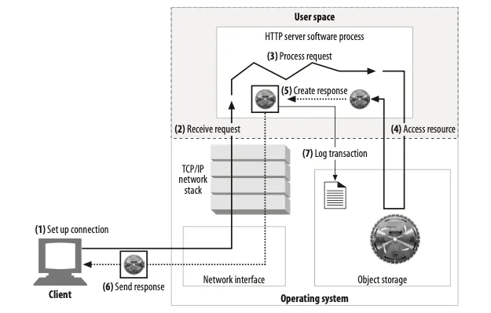
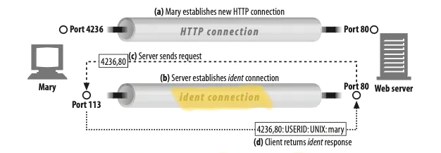
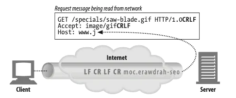
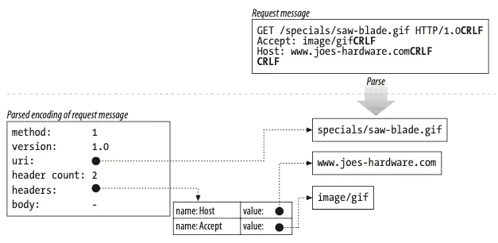
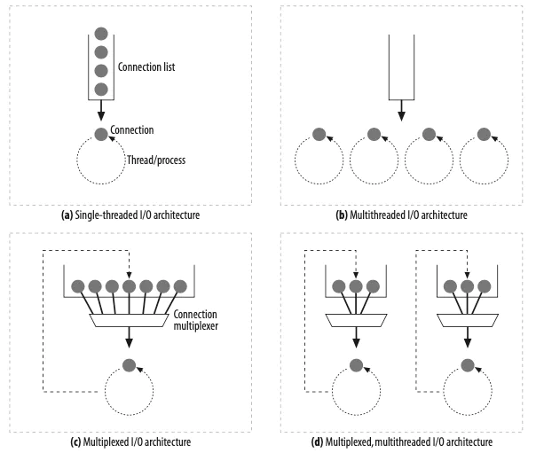
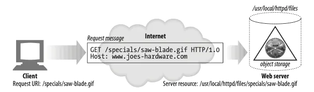

# 웹 서버

## 5.1 다채로운 웹 서버
- 웹 서버는 HTTP 리퀘스트를 받아들여 일련의 처리를 수행하고, 그 결과를 반환한다.
- 웹 서버는 서버 상의 소프트웨어를 가리킬 수도 있고, 웹 페이지를 제공하는 특정 디바이스나 컴퓨터를 의미할 수 있다.
- 모양이나 크기가 어떻든, 서버가 수행하는 역할은 리퀘스트를 받아 적절한 처리를 한 후 반환하는 일이다.

### 5.1.1 웹 서버 구현
- HTTP와 그와 관련된 TCP 커넥션 핸들링 기능이 구현되어 있다.
- 제공할 리소스의 관리 이외에도 그것들을 설정할 관리적인 기능도 포함하고 있다.
- 웹 서버 로직은 운영체제와 깊은 관련이 있는데, 운영체제는 서버의 하드웨어적인 디테일을 관리하고 TCP/IP 네트워크 및 리소스 파일 시스템을 지원한다.

## 5.3 웹 서버가 하는 일

1. 커넥션을 맺는다: 클라이언트의 접속을 받아들이거나, 원치 않는 클라이언트라면 닫는다.
2. 요청을 받는다: HTTP 요청 메시지를 네트워크로부터 읽어들인다.
3. 요청을 처리한다: 요청 메시지를 처리하고, 응답 메시지를 생성한다.
4. 리소스에 접근한다: 메시지에서 지정한 리소스에 접근한다.
5. 응답을 만든다: 올바른 헤더를 포함한 HTTP 응답 메시지를 생성한다.
6. 응답을 보낸다: 응답 메시지를 클라이언트에게 돌려준다.
7. 트랜잭션을 로그로 남긴다: 로그파일에 트랜잭션 완료에 대한 기록을 남긴다.

## 5.4 단계 1: 클라이언트 커넥션 수락

### 5.4.1 새 커넥션 다루기
- 클라이언트가 TCP 커넥션을 요청하면 커넥션을 수립하고 IP 주소를 추출함으로써 대상 클라이언트를 특정한다.
- 새 커넥션이 수립되면 서버는 해당 커넥션을 통해 들어오는 데이터가 있는지 주시하도록 된다.
- 웹 서버는 언제든 커넥션을 종료할 수 있는데, 예를 들면 클라이언트의 IP 주소와 호스트 명이 허가되지 않았거나 악의가 있는 존재로 인식된 경우이다.

### 5.4.2 클라이언트 호스트 명 식별
- 대부분의 웹 서버는 리버스 DNS 를 통해 클라이언트의 IP 주소를 클라이언트 호스트 명으로 변환할 수 있다.
- 이를 통해 얻은 클라이언트 호스트 명은 보다 디테일한 접근 제어 및 로그에 사용된다.

> 리버스DNS: DNS 의 반대 개념으로서 IP로 Domain name 을 조회하는 것

### 5.4.3 ident를 통해 클라이언트 사용자 알아내기

- 몇몇 웹 서버는 ident 프로토콜을 지원한다. ident 프로토콜은 어떤 유저명이 HTTP 커넥션을 시작하였는지 서버가 알 수 있도록 해준다.
- 이 정보는 웹 서버 로깅에 유용하다. 클라이언트가 ident 프로토콜을 지원하면, 클라이언트는 113 포트를 통해 ident 리퀘스트를 수신한다.

- ident는 회사 등 조직 내에서는 작동하지만 퍼블릭 인터넷 환경에서는 다음과 같은 이유로 잘 작동하지 않을 수 있다.
  - 많은 클라이언트 PC가 ident 소프트웨어를 돌릴 수 없음
  - 많은 방화벽이 ident 트래픽을 허용하지 않음
  - ident 프로토콜 자체가 안전하지 않음
  - ident 프로토콜이 가상 IP 주소를 제대로 지원하지 않음
  - 클라이언트 유저명을 노출하는 것에 대한 프라이버시 문제가 존재

## 5.5 단계 2: 요청 메시지 수신

- 메소드, URI, 버전 넘버 등을 찾아가며 요청 라인을 파싱함.
- CRLF로 구분하여 메시지 헤더들을 읽어들임
- 헤더의 끝을 의미하는 공백 줄을 탐지
- 요청 본문이 존재한다면 읽어들임
 
### 5.5.1 메시지의 내부 표현

- 요청 메시지를 조작하기 편하도 내부의 자료구조로 저장.

### 5.5.2 커넥션 인풋/아웃풋 프로세싱 설계

- 싱글 스레드 웹 서버: 한 번에 하나의 요청만 처리 가능. 트랜잭션이 끝나면 다음 커넥션이 진행. 매우 단순한 구조이지만 퍼포먼스적으로 불리함이 존재.
- 멀티 프로세스 멀티 스레드 웹서버: 동시에 여러 요청을 처리 가능. 다만 무수히 많은 커넥션을 동시에 처리한다면 시스템 자원을 소모하게 되므로, 일반적으로 최대 스레드/프로세스 수를 사전에 제한해 둠.
- 멀티플렉스 I/O 서버: 다수의 커넥션에 적합. 하나의 스레드로도 동시에 많은 I/O 채널을 효율적으로 관리 가능.
- 멀티플렉스 멀티스레드 웹 서버: 위의 서버의 형태를 복수의 스레드로 진행하는 형태.

## 5.6 단계 3: 요청 처리
- 요청을 받으면 메서드, 리소스, 헤더 본문 등을 이용해 요청을 처리

## 5.7 단계 4: 리소스의 매핑과 접근

### 5.7.1 Docroot

- 다양한 종류의 리소스 매핑 방법이 존재하지만, 가장 단순한 형태는 요청 URI를 웹 서버 파일 시스템에 대응하는 방법이다.
- 일반적으로 웹 서버 파일 시스템의 특별한 폴더를 웹 콘텐츠를 위해 예약해둔다.
- 웹 서버는 요청 메시지에서 URI를 가져와서 문서 루트 뒤에 붙인다.

### 5.7.2 디렉터리 목록
- 웹 서버는 파일이 아닌 디렉토리 URL을 수신할 수도 있다. 대부분의 웹 서버는 클라이언트가 디렉토리 URL을 요청할 때 다음과 같은 행동을 취한다.
  - 에러를 반환
  - 디렉토리 대신 인덱스 파일을 반환
  - 디렉토리를 스캔하여 해당 컨텐츠가 들어있는 HTML 페이지를 반환

### 5.7.3 동적 콘텐츠 리소스 매핑
- 웹 서버는 동적 리소스에 URI를 매핑할 수도 있다.
- 대부분의 웹 서버는 동적 리소스의 식별과 매핑에 대한 기본적인 메커니즘을 제공한다.

### 5.7.5 접근 제어
- 웹 서버는 특정 리소스에 액세스 컨트롤을 할당할 수도 있다.

## 5.8 5단계: 응답 만들기
- 웹 서버가 리소스를 식별해냈다면 요청 메소드 대로 처리를 수행하여 메시지를 보낸다.

### 5.8.1  응답 엔티티
- 트랜잭션이 리스폰스 본문을 생성한다면, 리스폰스 메시지에는 다음과 같은 항목이 대개 포함되게 된다.
  - Content-Type 헤더
  - Content-Length 헤더
  - 실제 응답 본문의 내용

### 5.8.2 MIME 타입 결정하기
- 웹 서버는 리스폰스 본문의 MIME 타입을 결정해야 한다. 여기에는 다양한 방법들이 존재한다.
  - mime.types: 파일명의 확장자를 타입 지정에 활용.
  - 매직 타이핑: 각 리소스의 내용과 패턴을 통해 타입을 지정.
  - 명시적 타이핑: 특정 파일이나 디렉토리 컨텐츠를 강제로 특정 타입으로 지정.
  - 타입 네고시에이션: 여러 타입 후보 중 가장 적절해 보이는 포맷을 이용.

### 5.8.3 리다이렉션
- 때때로 리스폰스로 리다이렉션을 반환하는 경우도 존재한다. 리다이렉트는 다음과 같은 경우에 유용하다.
  - 영구적으로 이동된 리소스
  - 일시적으로 이동된 리소스
  - 로드 밸런싱
  - 서버 선호도
  - 디렉토리명의 정규화

## 5.9 단계 6: 응답 보내기
- 웹 서버는 수신 때와 마찬가지의 이슈를 송신 시에도 겪는다.
- 비지속적인 커넥션의 경우 전체 메시지가 송신된 이후에 커넥션을 종료한다.
- 지속적인 커넥션의 경우에는 Content-Length 헤더가 제대로 계산되는지 확인한 상태로 커넥션을 열어 둔다.

## 5.10 단계 7: 로깅
- 트랜잭션이 완료되면 웹 서버는 로그 파일에 트랜잭션이 수행된 내용을 기록한다.